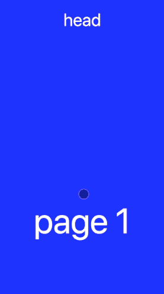

# react-scroll-paged-view
[以中文查看](./README_zh-CN.md)  
[If you are interested in my development process, you may read it, I believe you will gain something](./Dev_Record.md)  

**scroll view, Inside scroll, Full page scroll, Nesting ScrollView**  

## Installation
```
npm install react-scroll-paged-view --save
```

## Introduction
Support React(web) & React Native(RN)  
Support Subcomponents can choose whether or not to use scrollView  
Rolling integration in the whole page rolling page  
Ios RN code is perfectly supported, android is based on RN scrollView changed part of the code to supportbased on the project needs  
Currently there is no internal scrolling and page scrolling in the open source RN project. This component is written  
In addition, an additional core function module is provided. The RN side is a PagedView, and the web side is a ScrollableTabView  

## Notice
~~**Compatible version "react-native": "~0.54.0"**~~  
~~**The react native 0.47 version uses the 0.1.\* version**~~  
**Has been perfectly compatible with the above RN version, directly install the latest package**  
**Click events that do not appear in the internal scrollView component can be replaced with onPressIn**  

## Demo
| IOS | Android | Web |
| --- | ------- | --- |
|  |  |  |

## Usage

### External Full Page scroll
```
import ScrollPagedView from 'react-scroll-paged-view'
import InsideScrollView from './InsideScrollView'

...
    _onChange = (pageIndex) => {
        ...
    }

    render() {
        return (
            <ScrollPagedView
                onChange={this._onChange}
                onResponder={this._onResponder}
            >
                <InsideScrollView />
                <InsideScrollView />
                <InsideScrollView />
            </ScrollPagedView>
        )
    }
...
```

### Inside scrollView
```
...
    static contextTypes = {
        ScrollView: PropTypes.func,
    }

    render() {
        const ScrollView = this.context.ScrollView
        return (
            <ScrollView>
                ...
            </ScrollView>
        )
    }
...
```

## Properties

### ScrollPagedView
| Name | propType | default value | description |
| --- | --- | --- | --- |
| onChange | function | (pageIndex, oldPageIndex) => {} | Switch paging callback |
| onResponder(native only) | function | (isResponder) => {} | Gesture switch state callback |
| pageProps(web only) | object | {} | ScrollableTabView Props |
| style | object | {} | ScrollPagedView style |

### Inside scrollView
Name | propType | default value | description
--- | --- | --- | ---
nativeProps(native only) | object | {} | RN scrollView Props
webProps(web only) | object | {} | Web scrollView Props

## Export module
- default - ScrollPagedView
- ScrollTabView

### ScrollTabView
The web version is similar to react-native-scrollable-tab-view and provides similar functionality  
The functionality of the Rn version is not as complete as the Web version, and the follow-up continues to improve  

### Properties
| Name | propType | default value | description |
| --- | --- | --- | --- |
| scrollWithoutAnimation | bool | false | Click on the top tab to toggle whether there is animation |
| locked | bool | false | Whether to allow drag toggle |
| infinite | bool | false | Whether it is an infinite scroll view |
| isDot | bool | false | Is there a bottom dot |
| tabLabels | array | [] | Tab index, using the children array index by default |
| initialPage | number | 0 | Initial page index |
| autoPlay | bool | false | Whether to auto rotate |
| autoPlayTime | number | 2 | Automatic carousel interval (in seconds) |
| vertical | bool | false | Whether to switch the view vertically |
| dotStyle | object | {} | Dot style |
| dotWrapStyle | object | {} | Dot external style |
| dotActiveStyle | object | {} | Dot activation style |
| onChange | function | () => {} | Toggle tab callback |
| renderTabBar | function | () => {} | tabBar component |
| duration(native only) | number | 200 | Animation duration |

## TODO
- [x] Optimize scroll region index, use proxy scrollView to complete
- [x] Android compatible React Native different versions
- [x] Support web side components
- [x] Optimize web side components
- [x] Optimize web infinite scrolling
- [x] Perfect web-side ScrollTabView
- [x] Optimize structure, code, unified naming
- [x] Uniformly compatible with different versions of React Native
- [x] Record development process
- [ ] Perfect rn end ScrollTabView achieves consistency with web performance
- [ ] More props configuration

## Changelog
- 0.1.*
- 1.0.*
- 1.1.*
- 1.2.*
- 1.3.*
- 1.5.*
