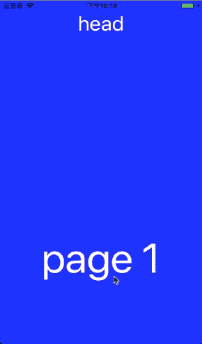
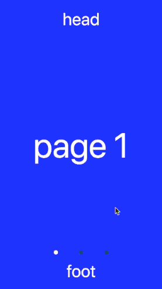

# react-scroll-paged-view
[以中文查看](./README_zh-CN.md)  
[If you are interested in my development process, you may read it, I believe you will gain something](./doc/Dev_Record.md)  

**scroll view, Inside scroll, Full page scroll, Nesting ScrollView**  

## Installation
```
npm install react-scroll-paged-view --save
```

## Introduction
Support React(web) & React Native(RN)  
Full-page scrolling and in-page scrolling  
iOS RN code is perfectly supported. Android provides native package support. Based on RN ScrollView, some code changes are supported  
There is no combination of internal scrolling and page scrolling in open source RN projects. Write this component based on need  
In addition, the core functional module ViewPaged is also available for use  
ScrollView component that provides subassembly packaging that can optionally be used  
All pagination loads on demand, don't worry about initial rendering  
Infinite pagination is also lazy, minimizing the current index page, even when switching quickly  
RN and web animation based on animated library, sharing a set of code processing  
Provides renderHeader and renderFooter for tab switching or carousel graphics, etc.  
Both components of the web version provide a class variable isTouch for judging whether it is a touch event, thereby distinguishing the scrolling triggered click event.  
Support for ssr, 2.1+ version removes the initial measurement size caused by repeated creation and destruction of components, better performance  
2.1.3+ version uses ScrollView as a scrolling container when scrolling horizontally and not infinitely, so subviews can be scrolled vertically using ScrollView  

## Notice
~~**Compatible version "react-native": "~0.54.0"**~~  
~~**The react native 0.47 version uses the 0.1.\* version**~~  
**Has been perfectly compatible with the above RN version, directly install the latest package**  
**Click events that do not appear in the internal ScrollView component can be replaced with onPressIn**  
**infinite and autoPlay are only available to the ViewPaged component, ScrollPagedView will turn off this option by default**

## Demo
| IOS | Android | Web |
| --- | ------- | --- |
|  |  |  |

### Other
What you can achieve depends on what you can imagine.  

| Horizontal | Tab | Carousel |
| ---------- | --- | -------- |
|  |  |  |

## Usage

### ScrollPagedView
The ScrollPagedView component encapsulates the inner scrolling component based on the ViewPaged component and uses it through the context.
```javascript
import ScrollPagedView from 'react-scroll-paged-view'
import InsideScrollView from './InsideScrollView'

...
    _onChange = (pageIndex) => {
        ...
    }

    render() {
        return (
            <ScrollPagedView
                onChange={this._onChange}
                onResponder={this._onResponder}
            >
                <InsideScrollView />
                <InsideScrollView />
                <InsideScrollView />
            </ScrollPagedView>
        )
    }
...
```

#### Context ScrollView(InsideScrollView)
```javascript
...
    static contextTypes = {
        ScrollView: PropTypes.func,
    }

    render() {
        const ScrollView = this.context.ScrollView
        return (
            <ScrollView>
                ...
            </ScrollView>
        )
    }
...
```

### ViewPaged
The ViewPaged component is consistent with the ScrollPagedView component and is free to use infinite and autoPlay.
```javascript
import { ViewPaged } from 'react-scroll-paged-view'
```

## Export module
- default - ScrollPagedView
- ViewPaged

## Properties

### ScrollPagedView
The ScrollPagedView component is based on the ViewPaged component, which can be passed to the props of the ViewPaged as needed. Refer to the props of the ViewPaged component below.  

| Name | propType | default value | description |
| --- | --- | --- | --- |
| withRef | bool | false | Get ViewPaged instance ref, through the component's getViewPagedInstance method |

### Context ScrollView
Name | propType | default value | description
--- | --- | --- | ---
nativeProps(native only) | object | {} | RN scrollView Props
webProps(web only) | object | {} | Web scrollView Props

### ViewPaged
RN and web have the same props and the performance is consistent  

#### Common Props
| Name | propType | default value | description |
| --- | --- | --- | --- |
| style | object | {} | ViewPaged style |
| initialPage | number | 0 | Initial page index |
| vertical | bool | true | Whether to switch the view vertically |
| onChange | function | () => {} | Switch paging callbacks, The parameters are currentPage and prevPage |
| duration | number | 400 | Animation duration(In milliseconds) |
| infinite | bool | false | Whether it is an infinite scroll view |
| renderHeader | function/element | undefined | Header Component, The parameters are activeTab, goToPage, width, pos |
| renderFooter | function/element | undefined | Footer Component, The parameters are activeTab, goToPage, width, pos |
| renderPosition | string | top | Header/Footer direction, There are 4 values, 'top', 'left', 'bottom', 'right' |
| autoPlay | bool | false | Whether to auto rotate |
| autoPlaySpeed | number | 2000 | Automatic carousel interval (In milliseconds) |
| hasAnimation | bool | true | Click to switch whether there is an animation |
| locked | bool | false | Whether to allow drag toggle |
| preRenderRange | number | 0 | Control the scope of the render component each time it is updated |
| isMovingRender | bool | false | Preload the next page when you touch Move |

#### RN Only Props
| Name | propType | default value | description |
| --- | --- | --- | --- |
| onStartShouldSetPanResponder | function | () => true | Reference React Native website gesture response system |
| onStartShouldSetPanResponderCapture | function | () => false | Reference React Native website gesture response system |
| onMoveShouldSetPanResponder | function | () => true | Reference React Native website gesture response system |
| onMoveShouldSetPanResponderCapture | function | () => false | Reference React Native website gesture response system |
| onPanResponderTerminationRequest | function | () => true | Reference React Native website gesture response system |
| onShouldBlockNativeResponder | function | () => true | Reference React Native website gesture response system |
| onPanResponderTerminate | function | () => {} | Reference React Native website gesture response system |

## TODO
- [x] Optimize scroll region index, use proxy scrollView to complete
- [x] Android compatible React Native different versions
- [x] Support web side components
- [x] Optimize web side components
- [x] Optimize web infinite scrolling
- [x] Perfect web-side ViewPaged
- [x] Optimize structure, code, unified naming
- [x] Uniformly compatible with different versions of React Native
- [x] Record development process
- [x] Perfect RN end ViewPaged achieves consistency with web performance
- [x] More props configuration

## Changelog
- 0.1.*
- 1.0.*
- 1.1.*
- 1.2.*
- 1.3.*
- 1.5.*
- 1.6.*
- 2.0.*
- 2.1.*

### 2.0.*
- Overall refactoring project to improve code reuse for web-side refactoring
- Added dependency package animated, smoother animation and better performance
- Use hoc to maximize the reuse of three-terminal public code, each side only retains the code of its own platform
- Unify the props on the RN and web, and make them consistent
- Support for ssr server rendering

### 2.1.*
- Unified RN and web render methods for ssr
- A separate render when removing the initial measurement component size
- Avoid sub-components to be created and destroyed repeatedly, with better performance

### 2.1.4+
- Remove configuration files such as. babelrc from the uploaded NPM package, react native will use the Babel configuration in the package, and failing to install these configuration dependencies will report errors

### 2.2.0+
- Optimize code structure, precisely control component render times, improve page performance, and provide preload and render scope props
