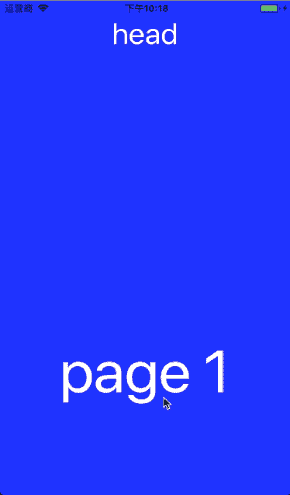
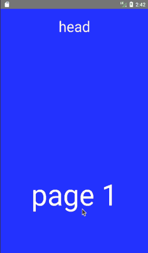
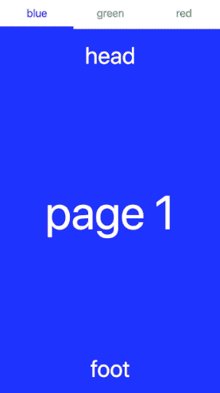
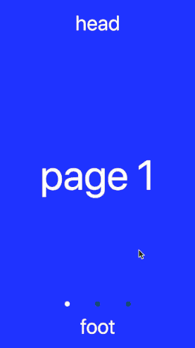

# react-scroll-paged-view
[View README in English](./README.md)  
[如果你对我的开发过程感兴趣不妨读读，相信会有所收获](./doc/Dev_Record.md)  

**滚动视图，内滚动，整页滚动，嵌套滚动视图**  

## 安装
```
npm install react-scroll-paged-view --save
```

## 简介
支持RN端，相应的web端组件也有  
整页滚动和页内滚动结合，类似京东等app的商品详情页上下页查看  
iOS RN代码完美支持，Android则提供了原生包支持，基于RN ScrollView改动了部分代码得以支持  
目前开源的RN项目中并没有内滚动和页滚动结合的，基于需要写了这个组件  
此外还额外提供了核心功能模块ViewPaged可供使用  
提供子组件封装的ScrollView组件，可以选择使用  
所有分页为按需加载，不必担心初始会全部渲染  
无限分页也是懒处理，最小程度校准当前索引页，即使快速切换滑动也很流畅  
RN和web动画基于animated库，共用一套代码处理  
提供了renderHeader和renderFooter可做tab切换或轮播图等  
web版的两个组件都有提供类变量isTouch用于判断是否为触摸事件，可借此区分滚动触发的点击事件  
支持ssr，2.1+版本移除初始测量尺寸所导致的组件重复创建和销毁，性能更好  
2.1.3+版本在为横向滚动且不无限滚动时使用ScrollView作为滚动容器，这样子视图可以使用ScrollView来纵向滚动  

## 注意
~~**兼容至"react-native": "~0.54.0"版本**~~  
~~**react native0.47版本的使用0.1.\*版本**~~  
**已完美兼容以上RN的版本，直接安装最新的包即可**  
**没有出现在内部ScrollView组件中的点击事件可以用onPressIn代替**  
**infinite和autoPlay只提供给ViewPaged组件，ScrollPagedView会默认关闭此选项**

## Demo
| IOS | Android | Web |
| --- | ------- | --- |
|  |  |  |

### Other
你所能实现的取决于你所能想象的  

| Horizontal | Tab | Carousel |
| ---------- | --- | -------- |
|  |  |  |

## 使用

### ScrollPagedView
ScrollPagedView组件基于ViewPaged组件封装了内滚动组件，通过context使用
```javascript
import ScrollPagedView from 'react-scroll-paged-view'
import InsideScrollView from './InsideScrollView'

...
    _onChange = (pageIndex) => {
        ...
    }

    render() {
        return (
            <ScrollPagedView
                onChange={this._onChange}
                onResponder={this._onResponder}
            >
                <InsideScrollView />
                <InsideScrollView />
                <InsideScrollView />
            </ScrollPagedView>
        )
    }
...
```

#### Context ScrollView(InsideScrollView)
```javascript
...
    static contextTypes = {
        ScrollView: PropTypes.func,
    }

    render() {
        const ScrollView = this.context.ScrollView
        return (
            <ScrollView>
                ...
            </ScrollView>
        )
    }
...
```

### ViewPaged
ViewPaged组件和ScrollPagedView组件用法一致，可以自由使用infinite和autoPlay
```javascript
import { ViewPaged } from 'react-scroll-paged-view'
```

## Export module
- default - ScrollPagedView
- ViewPaged

## 属性

### ScrollPagedView
ScrollPagedView组件基于ViewPaged组件，可以根据需要传入ViewPaged的props，参考下面ViewPaged组件的props  

| Name | propType | default value | description |
| --- | --- | --- | --- |
| withRef | bool | false | 获取ViewPaged实例ref，通过组件的getViewPagedInstance方法 |

### Context ScrollView
Name | propType | default value | description
--- | --- | --- | ---
nativeProps(native only) | object | {} | RN scrollView Props
webProps(web only) | object | {} | Web scrollView Props

### ViewPaged
RN和web有相同的props，表现也一致  

#### Common Props
| Name | propType | default value | description |
| --- | --- | --- | --- |
| style | object | {} | ViewPaged样式 |
| initialPage | number | 0 | 初始页索引 |
| vertical | bool | true | 是否为垂直切换视图 |
| onChange | function | () => {} | 切换分页回调，参数为currentPage和prevPage |
| duration | number | 400 | 动画持续时间(以毫秒为单位) |
| infinite | bool | false | 是否为无限滚动视图 |
| renderHeader | function/element | undefined | Header组件，参数为activeTab, goToPage, width, pos |
| renderFooter | function/element | undefined | Footer组件，参数为activeTab, goToPage, width, pos |
| renderPosition | string | top | Header/Footer方向，有4个值，分别为'top','left','bottom','right' |
| autoPlay | bool | false | 是否自动轮播 |
| autoPlaySpeed | number | 2000 | 自动轮播间隔时间(以毫秒为单位) |
| hasAnimation | bool | true | 点击切换时否有动画 |
| locked | bool | false | 是否允许拖动切换 |
| preRenderRange | number | 0 | 控制每次更新时render组件的范围 |
| isMovingRender | bool | false | 触摸移动时预加载下一页 |

#### RN Only Props
| Name | propType | default value | description |
| --- | --- | --- | --- |
| onStartShouldSetPanResponder | function | () => true | 参考React Native官网手势响应系统 |
| onStartShouldSetPanResponderCapture | function | () => false | 参考React Native官网手势响应系统 |
| onMoveShouldSetPanResponder | function | () => true | 参考React Native官网手势响应系统 |
| onMoveShouldSetPanResponderCapture | function | () => false | 参考React Native官网手势响应系统 |
| onPanResponderTerminationRequest | function | () => true | 参考React Native官网手势响应系统 |
| onShouldBlockNativeResponder | function | () => true | 参考React Native官网手势响应系统 |
| onPanResponderTerminate | function | () => {} | 参考React Native官网手势响应系统 |

## TODO
- [x] 优化滚动区域索引，使用代理ScrollView完成
- [x] Android兼容React Native不同版本
- [x] 支持web端组件
- [x] 优化web端组件
- [x] 优化web无限滚动
- [x] 完善web端ViewPaged
- [x] 优化结构、代码，统一命名
- [x] 统一兼容React Native不同版本
- [x] 记录开发过程
- [x] 完善RN端ViewPaged达到和web端表现一致
- [x] 更多props配置

## Changelog
- 0.1.*
- 1.0.*
- 1.1.*
- 1.2.*
- 1.3.*
- 1.5.*
- 1.6.*

### 2.0.*
- 整体重构项目，针对web端重构提高代码复用
- 增加了依赖包animated，动画处理更为流畅，性能更好
- 使用hoc最大程度复用了三端的公共代码，各个端仅保留自己平台的代码
- 统一了RN端和web端的props，并使其表现一致
- 针对ssr服务端渲染也做了支持

### 2.1.*
- 针对ssr统一了RN和web的render方法
- 移除初始测量组件尺寸时独立的一次render
- 避免子组件重复创建和销毁，性能更好

### 2.1.4+
- 移除了上传npm包里的.babelrc等配置文件，react native会使用包里的babel配置，没有安装这些配置依赖会报错

### 2.2.0+
- 优化代码结构，精确控制组件render次数，提高页面性能，并提供预加载和render范围的props
