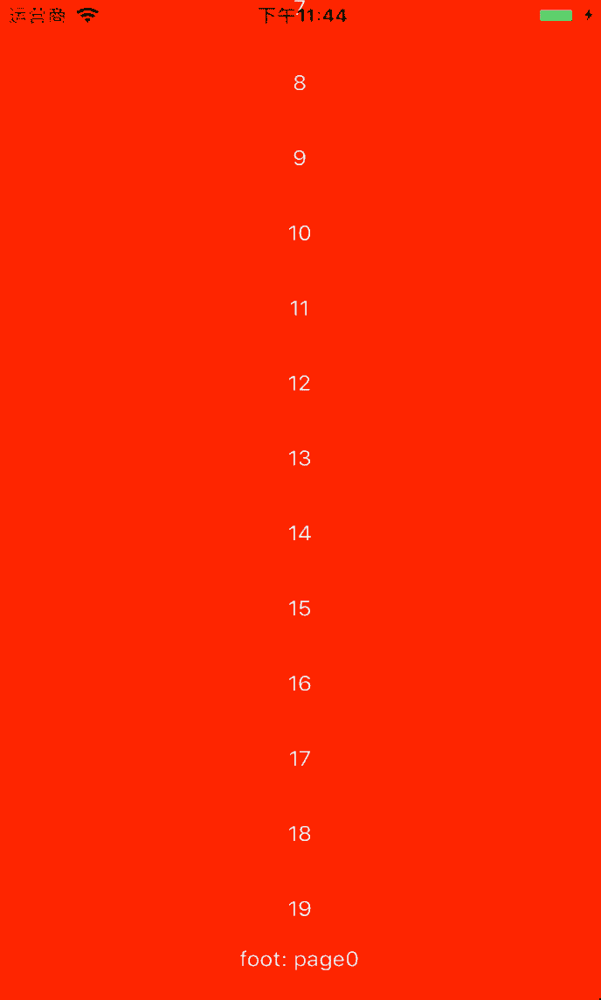
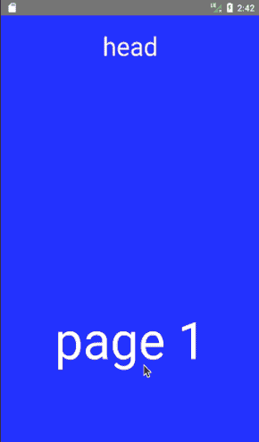

# react-scroll-paged-view
[View README in English](./README.md)
scroll view, Inside scroll, Full page scroll

## Installation
```
npm install react-scroll-paged-view --save
```

## Introduction
支持RN端，相应的web端组件也有  
子组件可以选择是否使用scrollView  
按页滚动和页内滚动结合，类似京东等app的商品详情页上下页查看  
ios RN代码完美支持，android则基于RN scrollView改动了部分代码得以支持  
目前开源的RN项目中并没有内滚动和页滚动结合的，基于项目需要写了这个组件  

## Notice
**兼容至"react-native": "~0.54.0"版本**  
**react native0.47版本的使用0.1.\*版本**  
**没有出现在内部scrollView组件中的点击事件可以由用nPressIn代替**  

## Demo
| IOS | Android |
| --- | ------- |
|  |  |

## Usage

### External Full Page scroll
```
import ScrollPagedView from 'react-scroll-paged-view'
import InsideScrollView from './InsideScrollView'

...
    _onPageChange = (pageIndex) => {
        ...
    }

    render() {
        return (
            <ScrollPagedView
                onPageChange={this._onPageChange}
                setResponder={this._setResponder}
            >
                <InsideScrollView />
                <InsideScrollView />
                <InsideScrollView />
            </ScrollPagedView>
        )
    }
...
```

### Inside scrollView
```
...
    static contextTypes = {
        ScrollView: PropTypes.func,
    }

    render() {
        const ScrollView = this.context.ScrollView
        return (
            <ScrollView>
                ...
            </ScrollView>
        )
    }
...
```

## Properties

### ScrollPagedView
Name | propType | default value | description
--- | --- | --- | ---
onPageChange | function | (pageIndex) => {} | Switch paging callback
setResponder(native only) | function | (isResponder) => {} | Gesture switch state callback

### Inside scrollView
Name | propType | default value | description
--- | --- | --- | ---
nativeProps(native only) | object | undefined | RN scrollView Props
webProps(web only) | object | undefined | Web scrollView Props
height(web only) | css unit | '100%' | Web scrollView Props
width(web only) | css unit | '100%' | Web scrollView Props

## Export module
- default - ScrollPagedView
- RN - PagedView
- Web - ScrollableTabView

## TODO
- [x] 优化滚动区域索引，使用代理scrollView完成
- [x] android兼容react native不同版本
- [x] 支持web端组件
- [ ] 更多props配置
- [ ] 优化web端组件

## Changelog
- 0.1.0
- 1.0.0
- 1.0.1
- 1.1.0
- 1.1.1
- 1.1.2
